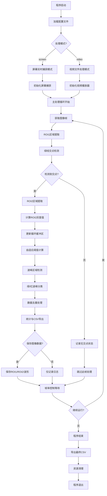
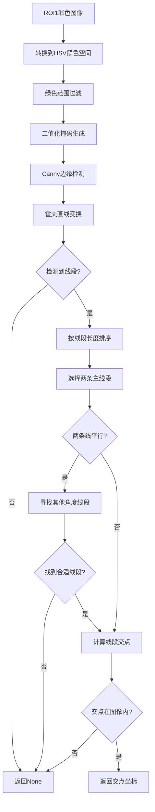
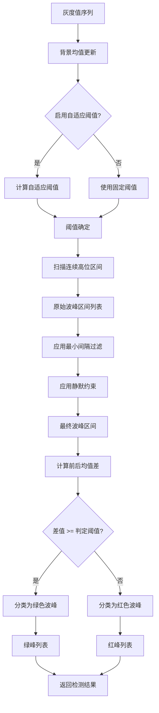
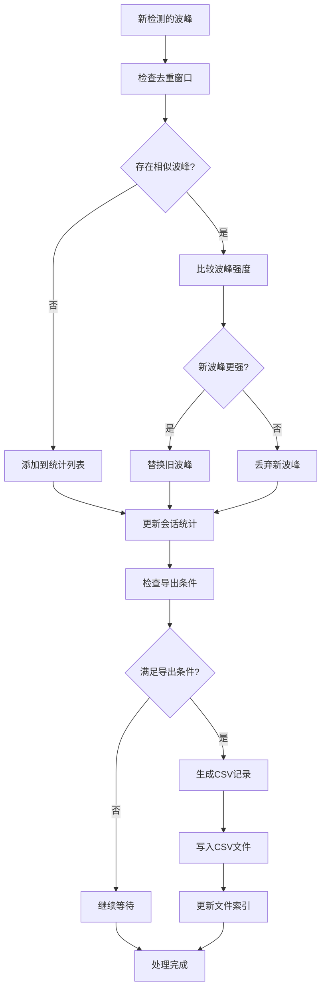
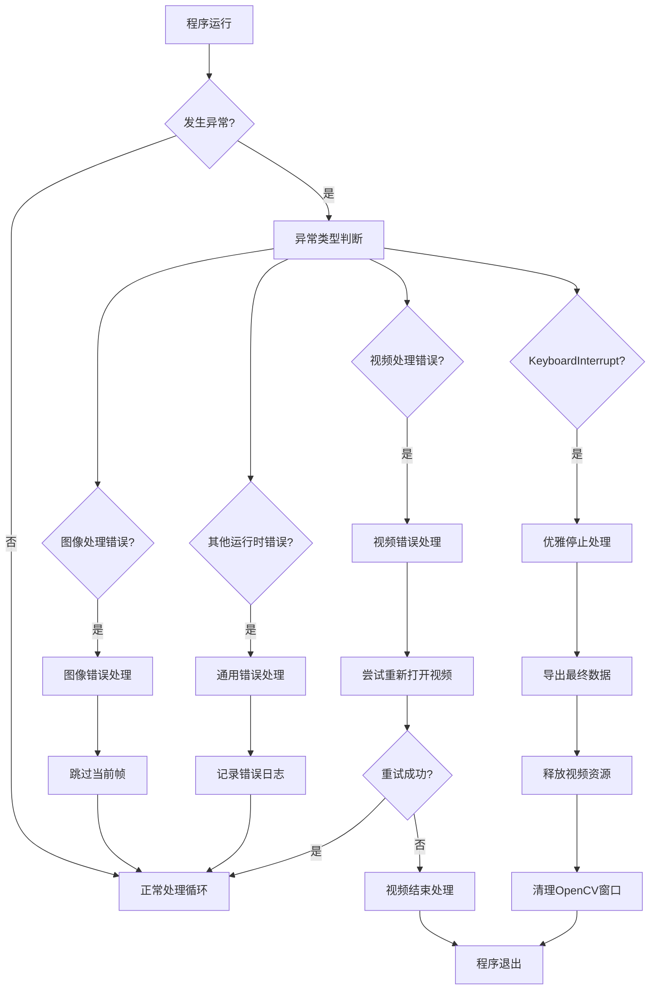
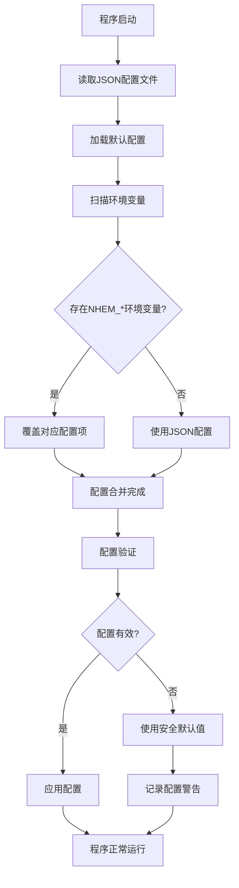

# SimpleFEM 处理流程图

## 整体系统架构流程



## 绿线检测算法流程



## 波峰检测算法流程



## 自适应阈值计算流程

```mermaid
graph TB
    A[当前帧灰度值] --> B{当前值 < 当前阈值?}

    B -->|否| C[跳过背景更新]
    B -->|是| D[更新背景累加值]

    D --> E[背景样本计数+1]
    E --> F{样本数 >= 最小要求?}

    F -->|否| G[使用固定阈值]
    F -->|是| H[计算背景均值]

    H --> I[自适应阈值 = 背景均值 × (1 + 上浮比例)]
    I --> J[返回自适应阈值]
    G --> K[返回固定阈值]

    C --> L[保持当前阈值]
    L --> M[返回当前阈值]
```

## 数据统计与去重流程



## 资源管理与错误处理流程



## 配置加载与优先级流程



这些流程图详细展示了 SimpleFEM 系统的各个处理阶段，为理解系统工作原理和排查问题提供了可视化的参考。